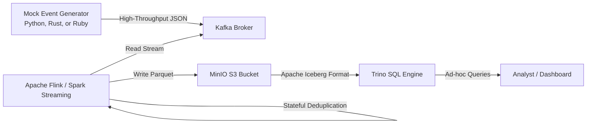

# Real-Time Event Ingestion & Transformation Lakehouse

> Build a real-time event ingestion and transformation pipeline that processes clickstream events, deduplicates them, and writes them to a local open-source data lakehouse.

## Architecture Pipeline

## Technology Stack

* **Ingestion**: **Apache Kafka** (a message queue that acts as a temporary buffer for high-throughput event data).
* **Producer Options**:
  * **Python**: Async event loop emitting JSON.
  * **Rust**: High-performance asynchronous producer using `rdkafka`. (Recommended for systems scale).
  * **Ruby**: Transactional Rails-style producer using `waterdrop`.
* **Processing**: **Apache Flink** or **Spark Structured Streaming** (real-time processing engines that execute transformations on data as it arrives).
* **Storage**: **MinIO** (a local, open-source version of Amazon S3 storage) and **Apache Iceberg** (a modern table layout format that allows you to treat raw files on S3 like clean SQL tables).
* **Querying**: **Trino** (a high-speed SQL query engine designed to run queries against data lakes without moving the data).
* **Infrastructure**: **Terraform** (a tool that lets you define your databases, queues, and storage buckets in code files, making it easy to create and destroy environments automatically).

## Key Features to Implement

1. **Local Infrastructure as Code (IaC)**: Write Terraform scripts using the Docker provider to spin up Kafka, MinIO buckets, and a Trino container automatically.
2. **Mock Data Generator**: Write a script (in Python, Rust, or Ruby) to stream 5,000 mock clickstream events/second into a Kafka topic.
3. **Stateful Deduplication**: Configure the streaming job (Flink or Spark) to use a 10-minute sliding window to filter out duplicate click events based on a unique `event_id`.
4. **Lakehouse Table Writing**: Write the cleaned stream directly into MinIO in the Apache Iceberg format. Organize files by event date.
5. **SQL Analytics**: Connect Trino to the MinIO catalog and run SQL queries to calculate real-time active users.

## Why This Project Highlights Expertise

It proves you understand the **Modern Data Lakehouse** pattern. You show that you can manage streaming states, handle late-arriving data, write files in columnar Parquet formats, and automate setup using Terraform.

## Step-by-Step Implementation Guide

1. **Step 1 (Workspace Setup)**: Create your project directory and initialize Git. Create a `terraform/` folder to manage infrastructure.
2. **Step 2 (Bootstrapping Infrastructure)**: Write a `main.tf` file using the Docker provider to define and launch Zookeeper, Kafka, MinIO, and Trino. Run `terraform init` and `terraform apply`.
3. **Step 3 (Building the Producer)**: Select your language (Python, Rust, or Ruby) and write the event generator using the code templates in the extension section below. Configure it to write to a Kafka topic named `clickstream-events`. Verify records are flowing using Kafka CLI console consumers.
4. **Step 4 (Writing the Stream Processor)**: Build a PySpark Streaming or PyFlink script. Load the schema, set a watermark of 2 minutes (allowing late data), implement sliding window deduplication, and write the output sink to MinIO using the Iceberg format.
5. **Step 5 (Querying the Lakehouse)**: Configure a Trino catalog properties file (`iceberg.properties`) linking to your local MinIO. Open the Trino CLI and run queries (e.g., `SELECT COUNT(*), event_name FROM clickstream_events GROUP BY event_name`) to verify data freshness.
