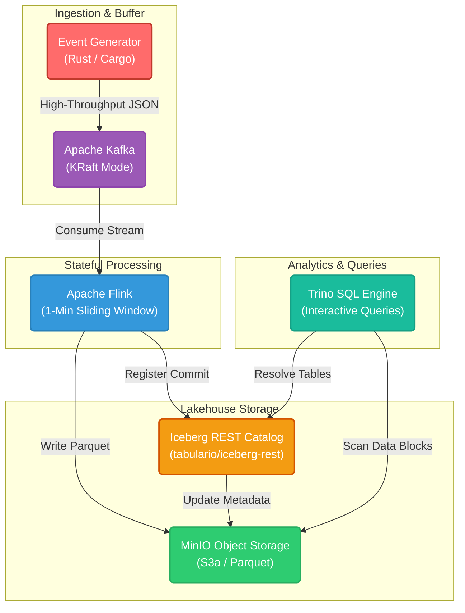

# Real-Time Clickstream Ingestion & Lakehouse Pipeline

A production-grade, local real-time event ingestion, deduplication, and transformation pipeline. This platform processes high-throughput clickstream event streams, performs stateful sliding-window deduplication, and writes optimized columnar data to an open-source Data Lakehouse using Apache Iceberg, MinIO, and Trino.

---

## System Architecture

The pipeline decouples event generation, stream buffering, stateful processing, storage, and query analytics into isolated, horizontally scalable layers:



---

## Key Architectural Patterns & Features

### 1. High-Throughput Buffering (Ingestion Layer)

- **Engine**: **Apache Kafka** (running in KRaft mode, eliminating ZooKeeper dependencies).
- **Design**: Serves as a backpressure-resistant, distributed log buffer. It decouples high-frequency producers (e.g., client clickstream generators writing 5,000+ events/sec) from downstream stream processors.
- **Topics**: Subdivided into partitions to parallelize ingestion and permit multi-task stream reading.

### 2. Stateful Stream Processing & Deduplication (Processing Layer)

- **Engine**: **Apache Flink**
- **Sliding-Window Deduplication**: Processes raw events in real time. Using a **1-minute sliding window** keyed by `event_id`, the engine maintains state to identify and discard duplicate events generated by network retries or client-side double-clicks.
- **Late-Data Handling**: Configured with a **2-minute watermark threshold** to handle late-arriving events out-of-order without stalling pipeline throughput.

### 3. Shared Metadata Catalog (Catalog Layer)

- **Engine**: **Apache Iceberg REST Catalog** (`tabulario/iceberg-rest`)
- **Design**: Acts as the single source of truth for table schemas, namespaces, and transaction histories. By decoupling catalog management from individual engine classpaths, Flink and Trino can seamlessly synchronize on table snapshots. Flink writes and registers transaction snapshots to the REST catalog via `HadoopFileIO`, and Trino queries them directly.

### 4. Open Lakehouse Table Format (Storage Layer)

- **Layout**: **Apache Iceberg** on **MinIO S3**
- **Optimized Storage**: Data is written in compressed, columnar **Parquet** format. Rather than treating raw files as directory trees, Iceberg manages them as structured SQL tables.
- **Partitioning & Compaction**: Iceberg tables are partitioned dynamically by event date (`event_date`). This enables partition pruning during queries, avoiding full table scans.
- **ACID Transactions**: Guarantees atomic writes, schema evolution, and time-travel capabilities for auditability.

### 5. Zero-Copy Analytics (Query Layer)

- **Engine**: **Trino SQL Engine**
- **Design**: Enables sub-second SQL queries directly against parquet data files on MinIO without loading them into an operational database.
- **Metadata Integration**: Trino queries the Iceberg REST Catalog directly, pruning files at the catalog level before retrieving data blocks from S3 storage.

### 6. Unified Infrastructure as Code (Deployment Layer)

- **Engine**: **Terraform** (Docker provider)
- **Design**: The entire cluster—Kafka, Flink, MinIO, REST Catalog, and Trino—is declared as code. Infrastructure state, networking, and volumes are managed automatically, enabling deterministic local spin-up and teardown.

---

## Technology Stack & Integrations

- **Ingestion & Broker**: **Apache Kafka** 4.x
- **Producers**:
  - **Rust**: High-performance async producer using `rdkafka` (systems scale).
- **Stream Processing**: **Apache Flink** 1.19.0 (custom image bundling S3A support).
- **Metadata Catalog**: **Tabular Iceberg REST Catalog** (0.6.0).
- **Storage**: **MinIO** (local S3-compatible object store) + **Apache Iceberg** table format.
- **SQL Analytics**: **Trino** query coordinator.
- **Infrastructure**: **Terraform** orchestrating Docker networks, storage volumes, container resources, and environment dependencies.

---

## 🚀 Execution Guide (How to Run)

Follow these steps to build, deploy, and run the pipeline locally:

### 1. Spin up the Infrastructure (Docker & Terraform)

Orchestrate Kafka, MinIO, Flink, REST Catalog, and Trino containers:

```bash
cd terraform
terraform apply -auto-approve
```

### 2. Run the Event Producer (Rust)

Navigate back to the project root directory and start the generator to stream click events to Kafka and create the topic:

```bash
cargo run
```

### 3. Build the Flink Job

Package the Java stream processing engine into a deployable fat JAR:

```bash
cd flink-processor
mvn clean package
```

### 4. Deploy the Stream Processor

Copy the compiled JAR to the running Flink JobManager container and execute the job:

```bash
# Copy the JAR to JobManager container
docker cp target/flink-processor-1.0-SNAPSHOT.jar local-flink-jobmanager:/tmp/

# Submit the job to the cluster
docker exec -t local-flink-jobmanager flink run /tmp/flink-processor-1.0-SNAPSHOT.jar
```

### 5. Monitor and Query

Access the cluster dashboards and SQL engines to observe live pipelines:

- **Kafka UI**: [http://localhost:8082](http://localhost:8082) (Monitor partitions and message throughput)
- **Flink Dashboard**: [http://localhost:8081](http://localhost:8081) (Observe stream graphs and watermarks)
- **MinIO S3 Console**: [http://localhost:9001](http://localhost:9001) (Credentials: `admin` / `supersecret`)
- **Trino CLI**: Connect to the running Trino container:

  ```bash
  docker exec -it local-trino trino
  ```

  Run queries against your Iceberg catalog:

  ```sql
  -- Check table partitions and schema
  DESCRIBE iceberg.default.clickstream_events;

  -- Count ingested records
  SELECT count(*) FROM iceberg.default.clickstream_events;

  -- Query real-time records
  SELECT * FROM iceberg.default.clickstream_events LIMIT 10;
  ```
