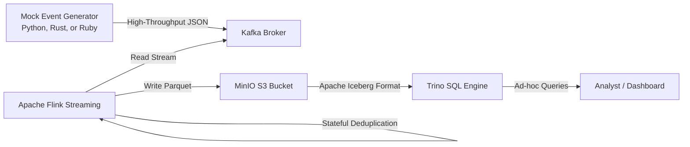

# Real-Time Clickstream Ingestion & Lakehouse Pipeline

A production-grade, local real-time event ingestion, deduplication, and transformation pipeline. This platform processes high-throughput clickstream event streams, performs stateful sliding-window deduplication, and writes optimized columnar data to an open-source Data Lakehouse using Apache Iceberg, MinIO, and Trino.

---

## System Architecture

The pipeline decouples event generation, stream buffering, stateful processing, storage, and query analytics into isolated, horizontally scalable layers:

---

## Key Architectural Patterns & Features

### 1. High-Throughput Buffering (Ingestion Layer)

- **Engine**: **Apache Kafka**
- **Design**: Serves as a backpressure-resistant, distributed log buffer. It decouples high-frequency producers (e.g., web/mobile client clickstream generators writing 5,000+ events/sec) from downstream stream processors.
- **Topics**: Subdivided into partitions to parallelize ingestion and permit multi-task stream reading.

### 2. Stateful Stream Processing & Deduplication (Processing Layer)

- **Engine**: **Apache Flink**
- **Sliding-Window Deduplication**: Processes raw events in real time. Using a **1-minute sliding window** keyed by `event_id`, the engine maintains state to identify and discard duplicate events generated by network retries or client-side double-clicks.
- **Late-Data Handling**: Configured with a **2-minute watermark threshold** to handle late-arriving events out-of-order without stalling pipeline throughput.

### 3. Open Lakehouse Table Format (Storage Layer)

- **Catalog & Layout**: **Apache Iceberg** on **MinIO S3**
- **Optimized Storage**: Data is written in compressed, columnar **Parquet** format. Rather than treating raw files as directory trees, Iceberg manages them as structured SQL tables.
- **Partitioning & Compaction**: Iceberg tables are partitioned dynamically by event date (`event_date`). This enables partition pruning during queries, avoiding full table scans.
- **ACID Transactions**: Guarantees atomic writes, schema evolution, and time-travel capabilities for auditability.

### 4. Zero-Copy Analytics (Query Layer)

- **Engine**: **Trino SQL Engine**
- **Design**: Enables sub-second SQL queries directly against parquet data files on MinIO without loading them into an operational database.
- **Metadata Integration**: Trino queries the Iceberg metadata catalog directly, pruning files at the catalog level before retrieving data blocks from S3 storage.

### 5. Unified Infrastructure as Code (Deployment Layer)

- **Engine**: **Terraform** (Docker provider)
- **Design**: The entire cluster—Kafka, Flink, MinIO, and Trino—is declared as code. Infrastructure state, networking, and volumes are managed automatically, enabling deterministic local spin-up and teardown.

---

## Technology Stack & Integrations

- **Ingestion & Broker**: **Apache Kafka** running in KRaft mode (Kafka Raft metadata mode, eliminating ZooKeeper dependencies).
- **Producers**:
  - **Rust**: High-performance async producer using `rdkafka` (systems scale).
  - **Python**: Lightweight async event loop emitting JSON events.
  - **Ruby**: Transactional rails-style producer using `waterdrop`.
- **Stream Processing**: **Apache Flink** running in Docker containers.
- **Storage Catalog**: **MinIO** (local S3-compatible object store) + **Apache Iceberg** table format.
- **SQL Analytics**: **Trino** query coordinator.
- **Infrastructure**: **Terraform** orchestrating Docker networks, storage volumes, container resources, and environment dependencies.
